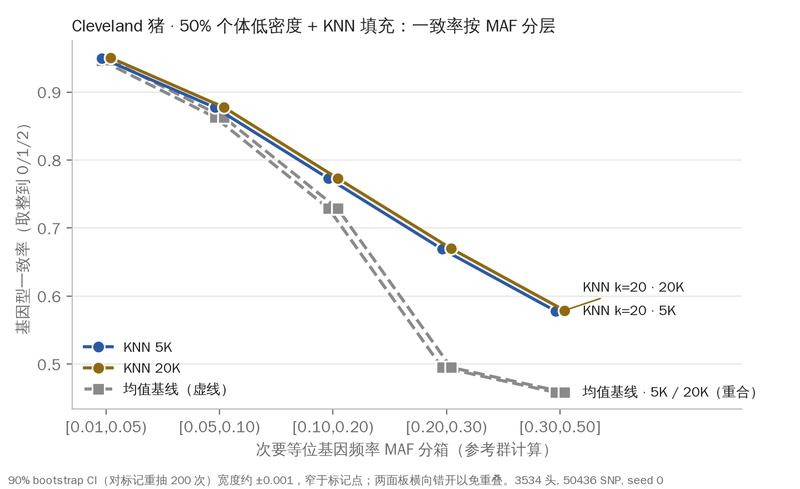

# Demo 1 · 填充准确度按 MAF 分层（Cleveland 猪公开数据）

对应 PRD v3 §1 第 3 行"低密度固相面板 + 填充可替代高密度"与 `docs/THEORY_REVIEW.md` 第 3 行的验证方式"Demo 1 记录填充准确度按 MAF 分层"。
复现：`python demo1/imputation/run.py --panel 5000,20000 --k 20 --seed 0`（约 70 秒，峰值内存约 2.2 GB；同种子两次运行 CSV 逐字节一致）。

## 设置

- 数据：Cleveland et al. 2012 (G3) PIC 猪 curated rdata（sha256 前缀 `9968d60791971d9b`，运行时校验），3,534 头 × 52,843 SNP，MAF ≥ 0.01 质控后 50,436 个标记。
- 掩码：随机 50% 个体（1,767 头）作为低密度个体，只保留面板标记；另外 50%（1,767 头）作为高密度参考群。
- 面板：从 50,436 个标记中随机抽 5,000（激进 SKU）和 20,000（PRD 所说 20K–65K 固相区间的下沿）。**65K 不适用**：它超过本数据质控后的标记总数 50,436。
- 填充：个体间 KNN，k = 20，在面板标记剂量上计算欧氏距离，预测值取 20 个最近参考个体剂量的等权均值（与 `lowdensity-sku/experiments.py` Task C 做法相同）。基线是参考群的列均值（2 × 等位基因频率）。
- 指标：对每个隐藏标记，把预测值和真值都取整到 {0,1,2} 后计算一致率，再算剂量相关 r²。MAF 在参考群上计算后分箱。90% CI 来自箱内对标记做 200 次 bootstrap。`all` 行包含参考群 MAF < 0.01 的少量标记（5K 面板 62 个，20K 面板 42 个），它们不属于任何分箱。

## 结果

| 面板 | 方法 | MAF 分箱 | 标记数 | 一致率 | 90% CI | r² | 一致率<0.9 占比 |
|---|---|---|---:|---:|---|---:|---:|
| 5K | KNN k=20 | [0.01,0.05) | 4,446 | 0.9499 | [0.9494, 0.9503] | 0.282 | 0.8% |
| 5K | KNN k=20 | [0.05,0.10) | 4,338 | 0.8772 | [0.8765, 0.8778] | 0.312 | 77.6% |
| 5K | KNN k=20 | [0.10,0.20) | 8,816 | 0.7729 | [0.7722, 0.7736] | 0.313 | 100.0% |
| 5K | KNN k=20 | [0.20,0.30) | 9,302 | 0.6692 | [0.6685, 0.6698] | 0.320 | 100.0% |
| 5K | KNN k=20 | [0.30,0.50] | 18,472 | 0.5782 | [0.5778, 0.5787] | 0.320 | 100.0% |
| 5K | KNN k=20 | **all** | 45,436 | 0.7001 | [0.6989, 0.7011] | 0.314 | 88.0% |
| 5K | 均值基线 | [0.01,0.05) | 4,446 | 0.9464 | [0.9459, 0.9470] | — | 1.6% |
| 5K | 均值基线 | [0.05,0.10) | 4,338 | 0.8629 | [0.8622, 0.8636] | — | 88.0% |
| 5K | 均值基线 | [0.10,0.20) | 8,816 | 0.7290 | [0.7280, 0.7299] | — | 100.0% |
| 5K | 均值基线 | [0.20,0.30) | 9,302 | 0.4952 | [0.4935, 0.4972] | — | 100.0% |
| 5K | 均值基线 | [0.30,0.50] | 18,472 | 0.4585 | [0.4581, 0.4588] | — | 100.0% |
| 5K | 均值基线 | **all** | 45,436 | 0.6055 | [0.6042, 0.6069] | — | 89.1% |
| 20K | KNN k=20 | [0.01,0.05) | 2,985 | 0.9502 | [0.9497, 0.9507] | 0.285 | 0.9% |
| 20K | KNN k=20 | [0.05,0.10) | 2,911 | 0.8774 | [0.8765, 0.8782] | 0.316 | 78.0% |
| 20K | KNN k=20 | [0.10,0.20) | 5,917 | 0.7731 | [0.7724, 0.7739] | 0.315 | 100.0% |
| 20K | KNN k=20 | [0.20,0.30) | 6,251 | 0.6699 | [0.6691, 0.6707] | 0.323 | 100.0% |
| 20K | KNN k=20 | [0.30,0.50] | 12,330 | 0.5789 | [0.5784, 0.5794] | 0.321 | 100.0% |
| 20K | KNN k=20 | **all** | 30,436 | 0.7009 | [0.6998, 0.7018] | 0.316 | 88.0% |
| 20K | 均值基线 | [0.01,0.05) | 2,985 | 0.9467 | [0.9460, 0.9474] | — | 1.4% |
| 20K | 均值基线 | [0.05,0.10) | 2,911 | 0.8625 | [0.8616, 0.8633] | — | 88.5% |
| 20K | 均值基线 | [0.10,0.20) | 5,917 | 0.7288 | [0.7276, 0.7299] | — | 100.0% |
| 20K | 均值基线 | [0.20,0.30) | 6,251 | 0.4951 | [0.4924, 0.4973] | — | 100.0% |
| 20K | 均值基线 | [0.30,0.50] | 12,330 | 0.4586 | [0.4581, 0.4591] | — | 100.0% |
| 20K | 均值基线 | **all** | 30,436 | 0.6058 | [0.6041, 0.6076] | — | 89.1% |

均值基线的预测是常数，r² 没有定义，所以记为"—"（CSV 中留空）。图见 `figures/imputation_by_maf.png`。

## 解读

一致率随 MAF 单调下降：KNN 在 [0.01,0.05) 箱约为 0.95，在 [0.30,0.50] 箱只有约 0.58。但低 MAF 箱的高一致率大部分是"猜多数纯合子"带来的，均值基线在这一箱也有 0.946，KNN 只高出 0.004，r² 只有 0.28。KNN 相对基线的增益集中在中高 MAF 箱：[0.20,0.30) 箱高 0.17，[0.30,0.50] 箱高 0.12。无论哪个面板，所有 MAF ≥ 0.10 的隐藏标记一致率都低于 0.9；全部隐藏标记中约 88% 低于 0.9。整体剂量 r² 约 0.31。**5K 与 20K 面板的结果几乎相同**（整体一致率 0.7001 对 0.7009，各箱差异 ≤ 0.001）。原因是全基因组 KNN 只用面板来找"亲缘最近的 20 头参考个体"，5K 标记已足够把亲缘关系估准。它不利用隐藏标记附近的局部连锁不平衡（LD）和单倍型，所以面板加密不会带来收益。因此本实验**不能用来区分 5K 与 20K 面板的价值**。要回答"多少密度够用"，需要一个基于单倍型和 LD 的填充器（见下文）。开发时另做过一次 k 敏感性诊断（只在 5K/20K 面板的前 6,000 个隐藏标记上，未写入产物）：k = 5 的整体一致率约 0.71，k = 1 约 0.68，说明 k = 20 已接近这一方法的上限，瓶颈在方法本身，不在 k 的取值。

## 诚实性说明

- **数据局限**：这是 2012 年整理的 PIC 单一核心群（单品系、系谱紧密）数据，基因型已经过预填充（剂量中约 0.13% 的隐藏格是小数，取整后参与一致率计算）。这意味着"真值"本身带有前一轮填充的误差，而且群体结构比多场、多品系的产业群体简单。
- **方法局限**：个体间 KNN 远弱于 Beagle、AlphaImpute、FImpute 这类基于单倍型、系谱和 LD 的工具。这类工具在猪、牛的低密度到中密度填充中通常能达到 0.9 以上的一致率，并且对面板密度敏感（Browning 2016；Sargolzaei 2014）。因此本表的绝对数值是**下限（floor）**，不能说成"低密度 + 填充可以达到的准确度"，更**不代表拉索面板的表现**：面板是随机抽取的标记，不是按 MAF、LD 均匀性或品种信息量设计的 SNP。
- **不适用项**：65K 面板超过本数据质控后的标记总数 50,436，无法评估。
- **可以说**：公开猪数据上已建立按 MAF 分层的填充评估流水线，结果可复现、有 CI，并给出一个朴素方法的下限。中高 MAF 标记是填充误差的主要来源，这些标记也是 GS 信息量的主要来源。
- **不能说**：拉索 20K/65K 面板加填充"可替代高密度"，或达到某个具体一致率。
- **有了真实拉索 20K/65K 面板设计和参考群后会变化的部分**：(1) 面板改为真实 SNP 位点（含物理位置），可以按染色体做基于单倍型的填充（Beagle 5 / AlphaImpute2 / FImpute），一致率和 r² 应显著高于本下限，并且会出现 5K 到 20K 到 65K 的密度梯度；(2) 参考群换成与目标群同品系、同世代、足够大的高密度（或测序）群体，并按世代留出验证（老一代作参考，新一代作低密度），而不是随机对半切分，避免亲缘泄漏让结果偏乐观；(3) 跨品种（杜长大等）分别报告，量化 THEORY_REVIEW 第 3 行提到的 ascertainment bias 带来的下降幅度；(4) 在填充基因型上重算 GEBV，报告预测准确度 r 的损失，这才是面板能否"替代"高密度的最终判据。

## 文件

- `run.py`：唯一入口，固定种子。rdata 以流式方式读取（已与 `rdata` 包整体解析的结果逐元素核对一致），峰值内存从约 5.8 GB 降到约 2.2 GB。
- `imputation_by_maf.csv`：上表的机器可读版本。
- `figures/imputation_by_maf.png`：dpi 200。
- `RUN.json`：种子、数据哈希（已校验）、面板规模、k、个体数和标记数、耗时、峰值 RSS。
